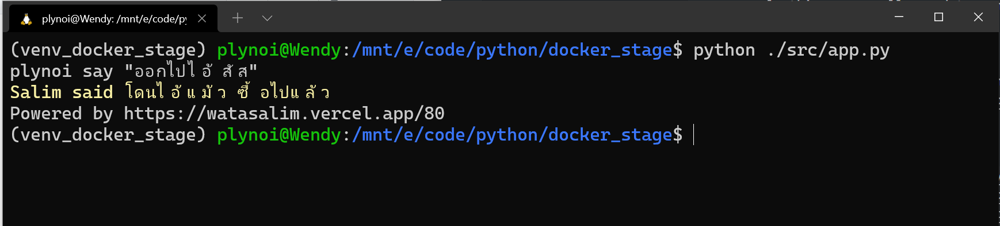
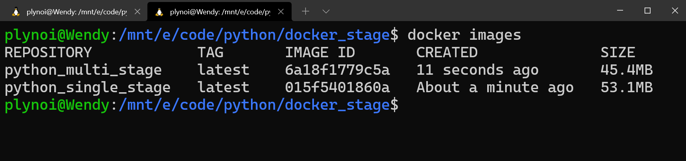

# Docker Multi-Stage Builds Size Comparison
- version: 1.0
- Last update: Aug 2021
- Environment: Windows WSL
- Prerequisite: [Docker and Internet connection](#prerequisite)

## <a id="intro"></a>Introduction

Docker is an open platform for developing, shipping, and running applications in a loosely isolated and consistent replication environment.

When creating Docker applications, it is a good practice to keep your images lightweight. There are many techniques to reduce the image size such as using ```.dockerignore``` file, optimize layers, using a small based image (such as ```*-alpine```) , etc. The [multi-stage builds](https://docs.docker.com/develop/develop-images/multistage-build/) is the one if the useful way to reduce image size and make readable Dockerfile.

## <a id="mulit_stage"></a>What is Multi-Stage Builds?

The multi-stage builds let you organize Dockerfile by split your Dockerfile into multiple stages with multiple ```FROM``` instructions. Each ```FROM``` instruction can use a different base, and each of them begins a new stage of the build. You can selectively copy artifacts/outputs from the previous stage to another, leaving behind everything you don’t want in the final image. The final image will contain only things you really need to run. 

## <a id="demo"></a>Demo Project

This demo project is a simple console application that requests an anonymous Far-right quote message from [@narze](https://twitter.com/narze)'s [Awesome Salim Quotes](https://watasalim.vercel.app/) application and API. The application is written in [Python](https://www.python.org/) with the following libraries:
- [requests](https://github.com/psf/requests)
- [Simple Chalk](https://github.com/olsonpm/py_simple-chalk)
- [python-dotenv](https://github.com/theskumar/python-dotenv)

 

## <a id="single_vs_multi"></a>Single-Stage Build vs Multi-Stage Builds

Let's compare single-stage build and multi-stage build scenarios. The application source code and requirements.txt files are the same.

### <a id="singlestage_dockerfile"></a>Single-Stage Dockerfile

A Dockerfile name is ```Dockerfile_singlestage```. I use just a simple ```python:3.8.11-alpine``` base image from the [Docker Hub repository](https://hub.docker.com/_/python), install dependencies from *requirements.txt*, copy the source code and run the file.

```
# Dockerfile single-stage build with Python Pip
FROM python:3.8.11-alpine 

WORKDIR /app
# Copy requirements.txt and install dependencies
COPY requirements.txt .
RUN pip install -r requirements.txt

# Set Docker and Applications Env
ENV USER=PYTHON_PIP_SINGLE

# Copy src
COPY src/ .
# Running application
CMD ["python","app.py"]
```
### <a id="singlestage_build"></a>Single-State Build

```
$> docker build . -f Dockerfile_singlestage -t python_single_stage
```

### <a id="singlestage_run"></a>Single-State Run

```
$> docker run --name singlestage --env-file .env python_single_stage
```
### <a id="multistage_dockerfile"></a>Multi-State Builds

A Dockerfile name is ```Dockerfile``` (a default one). The builder stage uses ```python:3.8.11-alpine``` base image from the [Docker Hub repository](https://hub.docker.com/_/python) to download and resolve dependencies.

The running stage also uses ```python:3.8.11-alpine``` base image, copy only dependencies files from the builder stage and the source code to run.

```
# Dockerfile multi-stage build with Python Pip
# Common Image
FROM python:3.8.11-alpine AS alpine
# Builder Stage
#FROM python:3.8.11-alpine as builder
FROM alpine as builder
COPY requirements.txt .
# install dependencies to the local user directory (eg. /root/.local)
RUN pip install --user -r requirements.txt

# Running Stage
FROM alpine  
WORKDIR /app

# copy only the dependencies installation from the 1st stage image
COPY --from=builder /root/.local /root/.local

# update PATH environment variables 
# Set Docker and Applications Env  
# set Python buffer to make Docker print every message instantly.
ENV PATH=/root/.local:$PATH \ 
    USER=PYTHON_PIP_MULTISTAGE \
    PYTHONUNBUFFERED=1

# Copy SRC
COPY src/ .
# Running application
CMD ["python","app.py"]
```
### <a id="multistage_build"></a>Multi-Stage Builds
```
$> docker build . -t python_multi_stage
```

### <a id="multistage_run"></a>Multi-Stage Run

```
$> docker run --name multistage --env-file .env python_multi_stage
```

## <a id="result"></a>Result

The sizes comparison result between *python_single_stage* and *python_multi_stage* images are the following:

 

## <a id="prerequisite"></a>Prerequisite
This demo project requires the following dependencies software.
1. Docker.
2. Internet connection.

## <a id="running"></a>Running the application.

The first step is to unzip or download the example project folder into a directory of your choice, then set up the project ```.env``` file based on your preference.

1. Start Docker
2. create a file name ```.env``` with the following content.
    ```
    MSG_INPUT=<Your Message>
    BASE_URL=https://watasalim.vercel.app
    # Random API
    API_ENDPOINT=/api/quotes/random

    # Latest API
    #API_ENDPOINT=/api/quotes/latest
    ```
3. Build a Docker image using the above steps: [Single-Stage Build](#singlestage_build) or [Multi-Stage Builds](#multistage_build)
4. Run a Docker container from resulting image using the above steps: [Single-Stage Run](#singlestage_run) or [Multi-Stage Run](#multistage_run)

## <a id="references"></a>References
For further details, please check out the following resources:
* [Use multi-stage builds](https://docs.docker.com/develop/develop-images/multistage-build/) on [Docker Documents page](https://docs.docker.com/).
* [Advanced Dockerfiles: Faster Builds and Smaller Images Using BuildKit and Multistage Builds](https://www.docker.com/blog/advanced-dockerfiles-faster-builds-and-smaller-images-using-buildkit-and-multistage-builds/) on [Docker Blog page](https://www.docker.com/blog/).